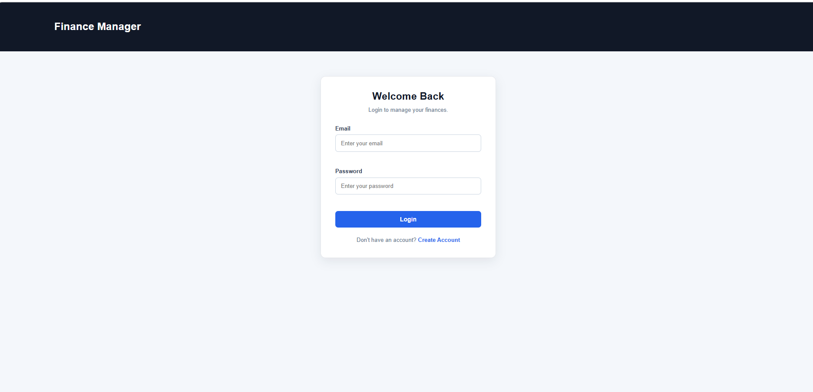
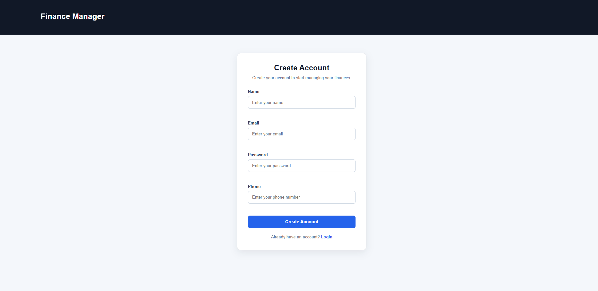
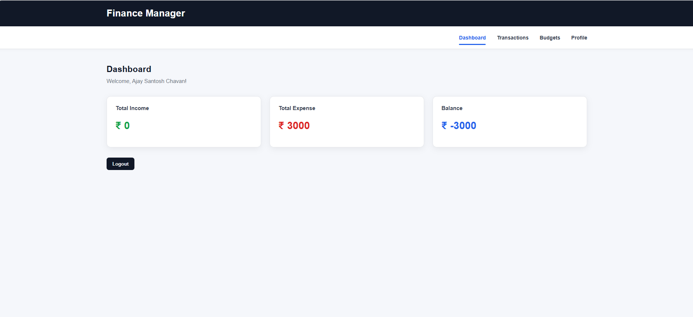
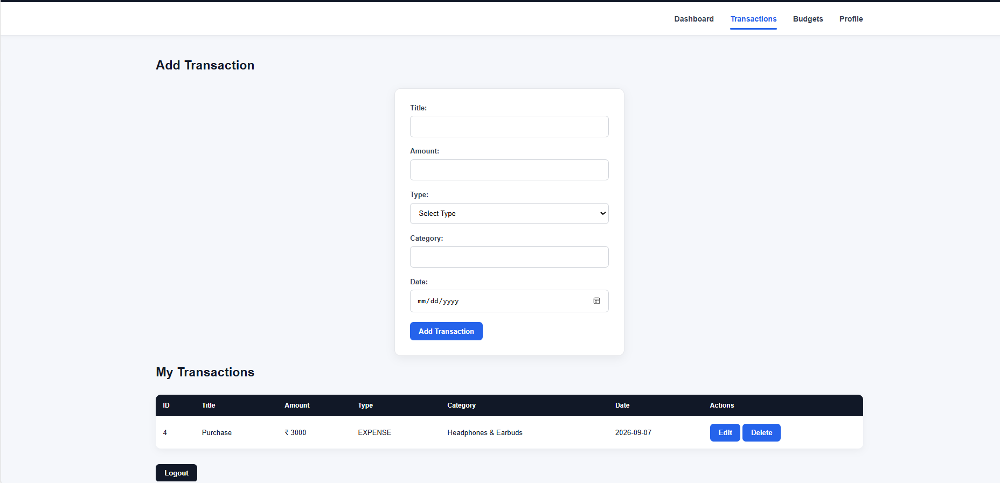
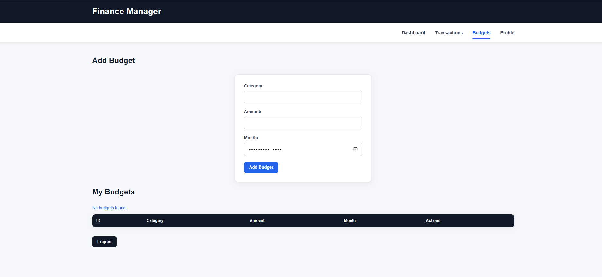
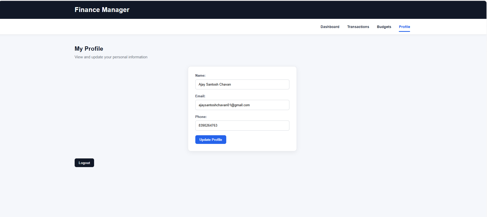

# Personal Finance Management System

A full-stack Personal Finance Management System built using Spring Boot, Spring Security, JWT Authentication, MySQL, HTML, CSS, and JavaScript.

The application allows users to securely manage their income, expenses, budgets, and profile information through a simple web interface.

## Features

### User Management

- User registration
- User login
- Secure password encryption using BCrypt
- View current user profile
- Update profile information
- Delete user account
- Email uniqueness validation

### Authentication & Security

- JWT-based authentication
- Stateless authentication
- Spring Security
- Protected REST APIs
- User ownership validation
- Users cannot access another user's data
- Secure password storage using BCrypt
- Environment variables for database password and JWT secret

### Transaction Management

- Add income and expenses
- View transactions
- View individual transaction
- Update transaction
- Delete transaction
- Transaction categories
- Transaction date
- Income and expense classification

### Budget Management

- Create budgets
- View budgets
- View individual budget
- Update budgets
- Delete budgets
- Category-based budgets
- Monthly budget management

### Dashboard

- Total income
- Total expenses
- Current balance
- User-specific financial information

### Frontend

- Dashboard
- Login page
- Registration page
- Transactions page
- Budgets page
- Profile page
- Responsive navigation
- Form validation
- JWT token handling using browser local storage

## Technologies Used

### Backend

- Java 17
- Spring Boot 4.1.1
- Spring Web MVC
- Spring Data JPA
- Spring Security
- JWT (JSON Web Token)
- Hibernate
- Maven

### Database

- MySQL 8.0

### Frontend

- HTML5
- CSS3
- JavaScript

### Development Tools

- Eclipse
- Git
- GitHub

## Project Structure

```text
finance-manager
│
├── src
│   └── main
│       ├── java
│       │   └── com.example.finance_manager
│       │       ├── config
│       │       │   └── SecurityConfig.java
│       │       │
│       │       ├── controller
│       │       │   ├── AuthController.java
│       │       │   ├── BudgetController.java
│       │       │   ├── DashboardController.java
│       │       │   ├── TransactionController.java
│       │       │   └── UserController.java
│       │       │
│       │       ├── dto
│       │       │   ├── AuthRequest.java
│       │       │   ├── AuthResponse.java
│       │       │   ├── AuthUpdateResponse.java
│       │       │   ├── BudgetResponse.java
│       │       │   ├── DashboardResponse.java
│       │       │   ├── TransactionResponse.java
│       │       │   ├── UpdateUserRequest.java
│       │       │   └── UserResponse.java
│       │       │
│       │       ├── entity
│       │       │   ├── Budget.java
│       │       │   ├── Transaction.java
│       │       │   ├── TransactionType.java
│       │       │   └── User.java
│       │       │
│       │       ├── exception
│       │       │   └── GlobalExceptionHandler.java
│       │       │
│       │       ├── repository
│       │       │   ├── BudgetRepository.java
│       │       │   ├── TransactionRepository.java
│       │       │   └── UserRepository.java
│       │       │
│       │       ├── security
│       │       │   ├── CurrentUserService.java
│       │       │   ├── CustomUserDetailsService.java
│       │       │   ├── JwtAuthenticationFilter.java
│       │       │   └── JwtService.java
│       │       │
│       │       └── service
│       │           ├── AuthService.java
│       │           ├── BudgetService.java
│       │           ├── TransactionService.java
│       │           └── UserService.java
│       │
│       └── resources
│           ├── static
│           │   ├── css
│           │   │   └── style.css
│           │   ├── js
│           │   │   └── app.js
│           │   ├── index.html
│           │   ├── login.html
│           │   ├── register.html
│           │   ├── dashboard.html
│           │   ├── transactions.html
│           │   ├── budgets.html
│           │   └── profile.html
│           │
│           └── application.properties
│
├── .gitignore
├── pom.xml
└── README.md


## Screenshots

### Login Page


### Register Page


### Dashboard


### Transactions


### Budgets


### Profile
